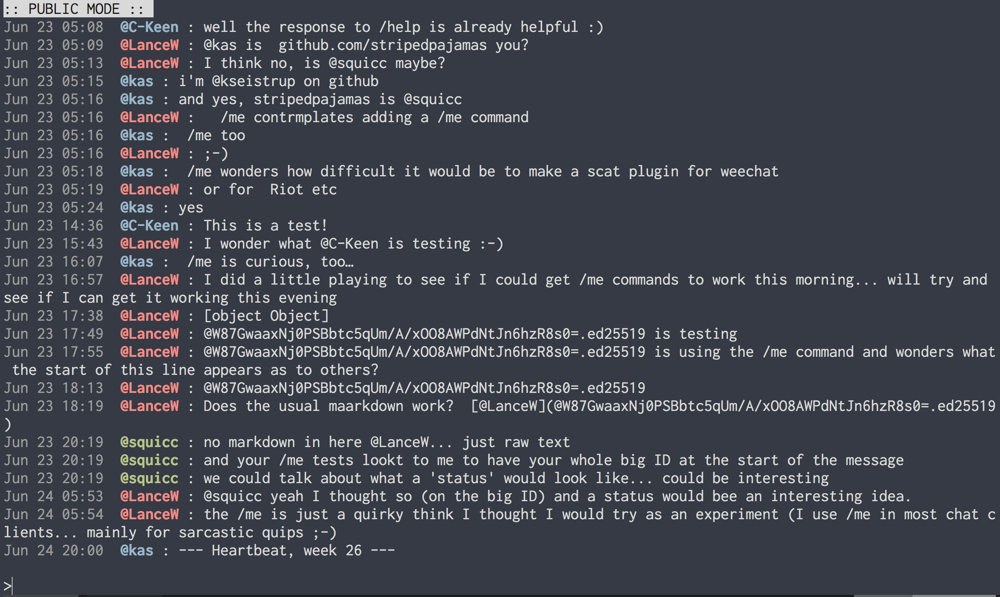

# :mouse: scat :mouse:
tiny chat-like cli built on scuttlebutt

### UPDATE 8/2020: I wrote a much leaner/simplified scat here https://github.com/stripedpajamas/scatzero


  




_Checkout [Gester](https://github.com/stripedpajamas/gester) if you're looking for another scuttlebutt chat app with the same functionality, but with a GUI :hamster:_

more on scuttlebutt: https://www.scuttlebutt.nz/

potentially chat with friends on the same network without even being connected to the internet :raised_hands:


### install / run
```bash
$ npm i -g ssb-chat
  ...
$ scat
```

### usage
```
$ scat
joel : what's up
pete : not much
...
> type a message and hit enter and it will publish a scat_message to your feed
```

if you have a notification in the top right corner, you can use `control-u` to cycle through your unread messages.

### command line arguments
by default scat pulls in 7 days of messages. if you want less or more, run scat with `--days`:

```
# this would pull in a month of data
$ scat --days 30
```

Emojis are supported by default, to disable run scat with `--no-emoji`:

```
# This will prevent :smiley: being displayed as 😊
$ scat --no-emoji
```

NB: If running scat via `npm start` you will need to prefix any command line args with `--`.
For example:
```
# Start scat from the git checkout with emoji disabled and a month of data
$ npm start -- --no-emoji --days 30
```

### commands
**type `/help` for a list of commands. type `/help <cmd>` for more info on that command.**

```
# to join a pub server:
> /pub invite-code

# to self-identify:
> /name name

# to identify someone else:
> /identify @id name

# to follow someone
> /follow @id

# to unfollow someone
> /unfollow @id

# to look up someone's id
> /whois @name

# to look up your own id
> /whoami

# to see unread notifications
> /notifications

# to reset unread notifications
> /clear

# to enter private mode
> /private @recipient1, @recipient2, ...

# to quit private mode
> /quit
```

use the `PageUp`/`PageDown` keys to scroll through previous messages. The status bar at the top will display `MESSAGE HISTORY` when scrolling. scat works in a 7 day window of data to keep things snappy.

### private messaging
scat supports sending private messages. so as not to muddy up the view with public and private messages, scat has you switch contexts by typing `/private` and then the name(s) (comma separated) of the private recipient(s) you want to converse with.

example:
```bash
> /private @joel # I want to send and receive private messages with Joel now
> hello # only visible to Joel
...
> /quit # I want to return to public messaging
...
> /private @joel, @kev # I want to send and receive private messages with both Joel and Kev
...
```

`/quit` returns you to the public context. scat will notify you when someone has sent you a private message (if you are in the public context or in the private context with a different user).

the ui makes all of this a lot more obvious than this readme :)

### what's happening
scat uses a special message type `scat_message`. this means that if you're using something like [Patchwork](https://github.com/ssbc/patchwork), your feed won't be all gobbled up by chat messages. And scat won't be all gobbled up by your posts.

but since it's all the same protocol and all the same feeds, all the same people are there. scat looks for `about` messages to show a user's name instead of their id, but falls back to the id if necessary.

scat will honor self-identification above a 3rd party's identification of another user, and scat will honor your identification of another user above their own self-identification. a 3rd party's identification of another user is not honored at all.

### license
MIT
